# Scenario-first graph index


Text-only reviewed design. Graph links do not create a fixed questionnaire or evidence credit.

## Conversation and preservation


```mermaid
flowchart TD
    read["Read the whole reply"]
    save["Preserve privately; verify or report a save failure"]
    stop["Stop requested?"]
    paused["Remain paused; no next question"]
    separate["Separate answer, correction and process feedback"]
    repair["Resolve process confusion; re-evaluate corrected sources"]
    choose["Choose one useful unanswered distinction"]
    gate["Context and prerequisites established?"]
    other["Skip this route; choose another or pause"]
    ask["Ask one contextualized question"]
    meaning["Retain only source-supported meaning"]
    information["Partial, unknown and declined stay distinct"]
    read -->|""| save
    save -->|"no saved claim without readback"| stop
    stop -->|"yes"| paused
    stop -->|"no"| separate
    separate -->|"when needed"| repair
    repair -->|""| choose
    separate -->|"otherwise"| choose
    choose -->|""| gate
    gate -->|"no"| other
    gate -->|"yes"| ask
    other -->|"another useful route"| choose
    other -->|"nothing useful remains"| paused
    ask -->|"next actual reply"| read
    separate -.->|"answer clauses"| meaning
    meaning -.->|"not a completed-profile score"| information
```

## An invitation and its reason


```mermaid
flowchart TD
    inv["Friend asks for company"]
    act["A reply is given"]
    why["Reason still missing?"]
    open["Ask an open reason question"]
    keep["Keep stated reason; do not re-ask"]
    away["Move to another useful scene"]
    inv -->|""| act
    act -->|"stop always overrides"| why
    why -->|"yes and useful"| open
    why -->|"no"| keep
    open -->|"after an actual explanation"| keep
    keep -->|"no hidden guilt search"| away
```

## A friend asks for company


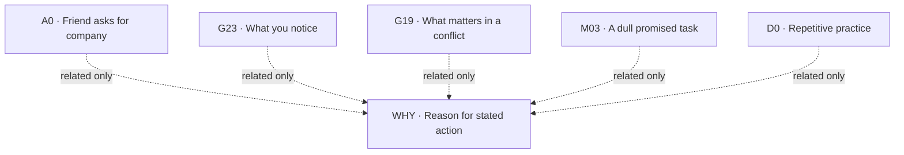

## Noticing needs and helping


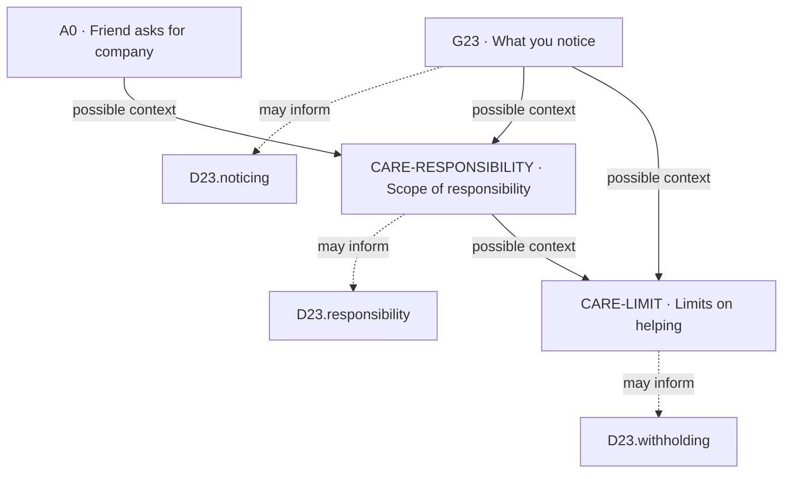

## Competing commitments


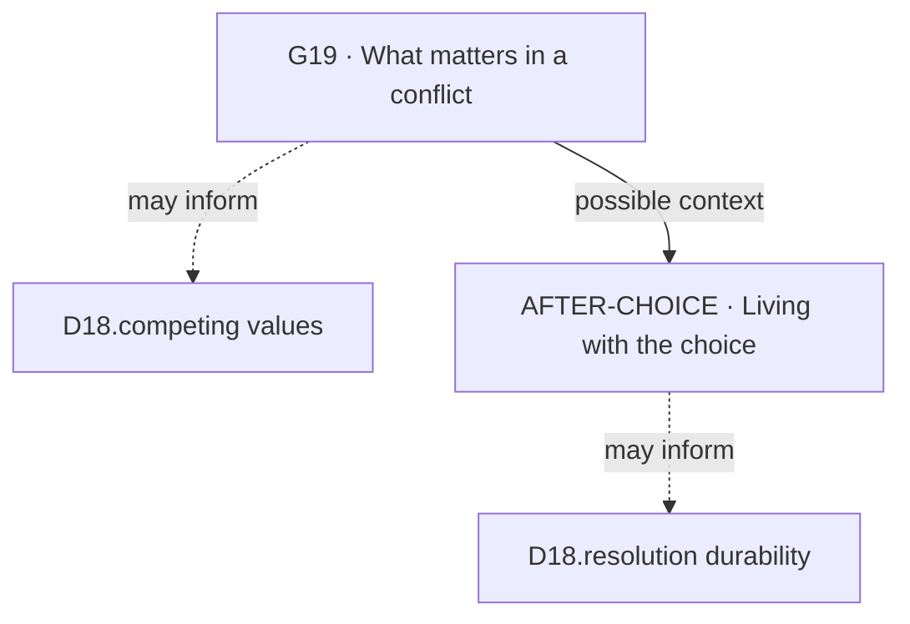

## Explaining and persuading


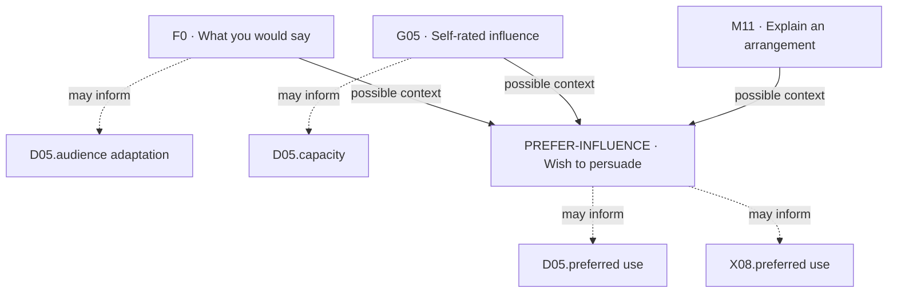

## Making a practical arrangement


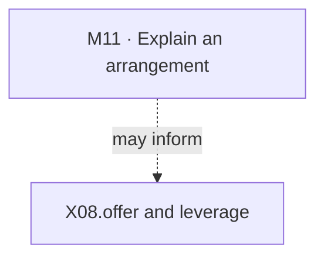

## Joining a group role


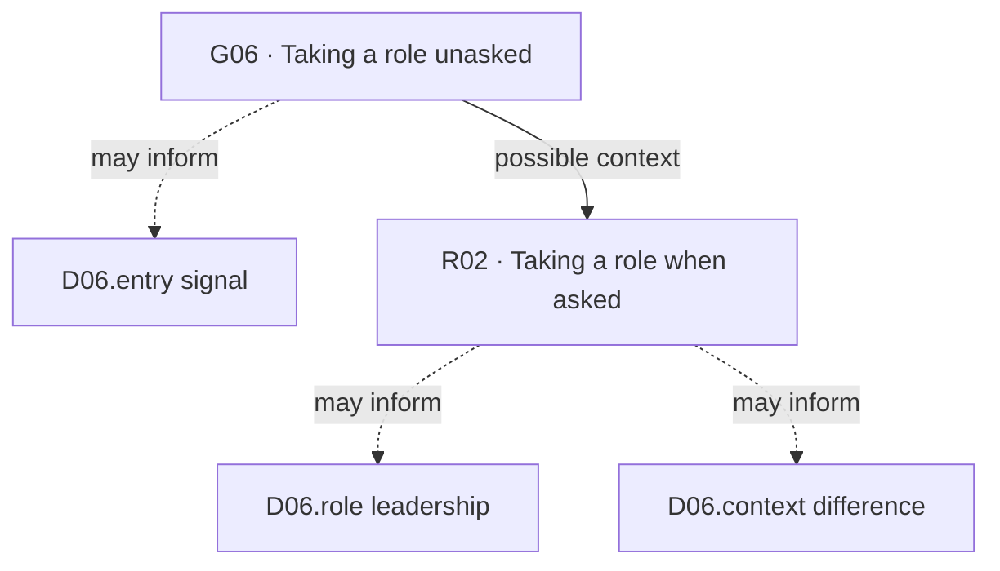

## How connections begin


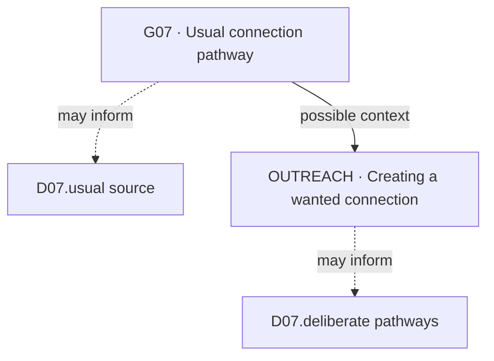

## Other people expect too much


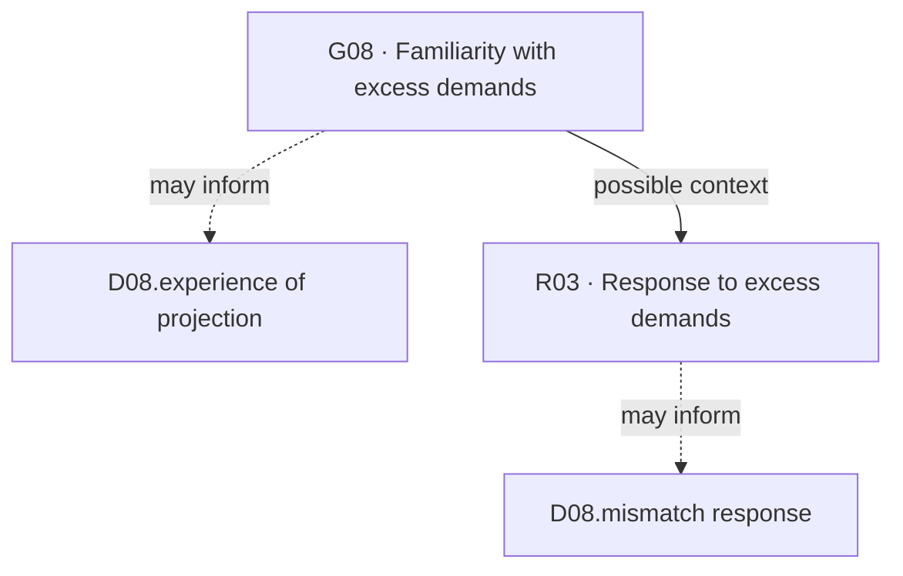

## Ability and learning


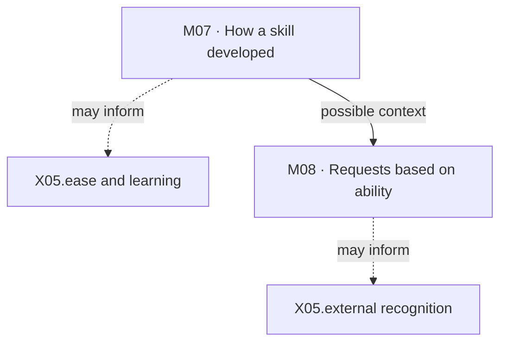

## Making sense of information


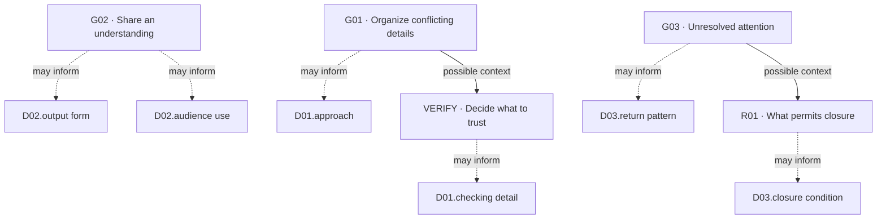

## Following or changing a method


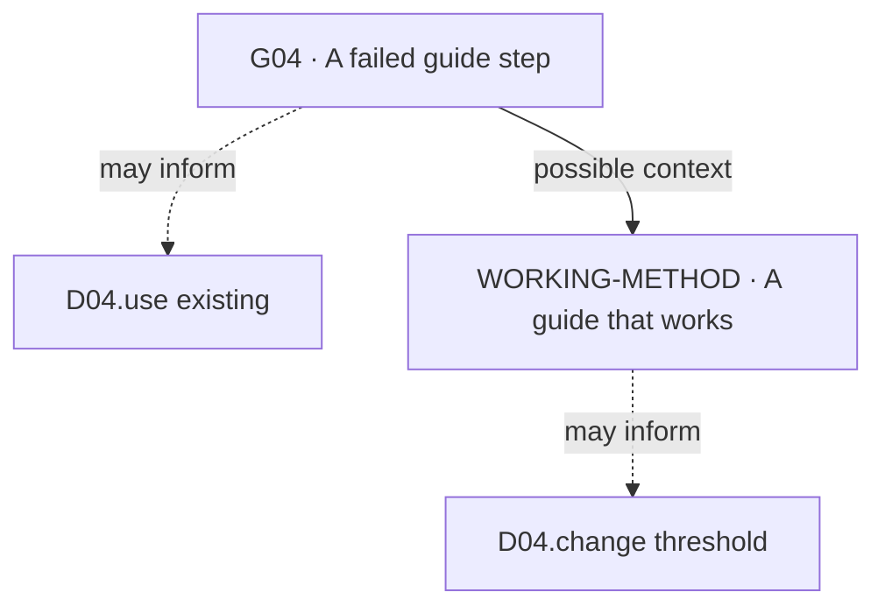

## Practice and concentration


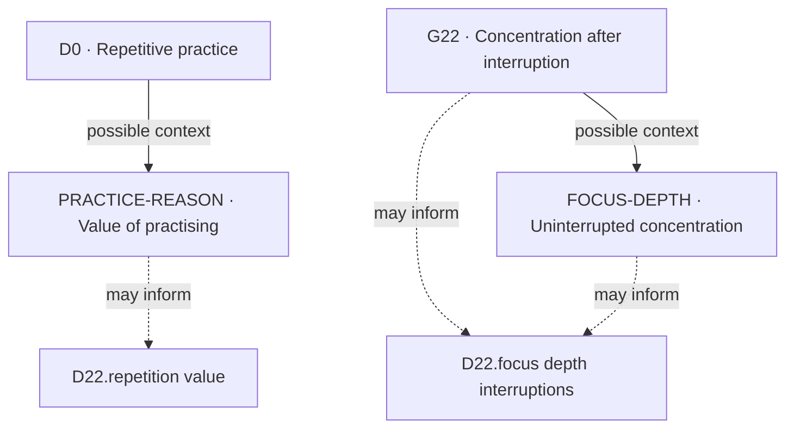

## Making a choice


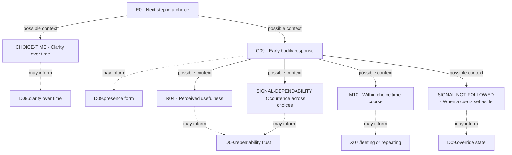

## Noticing a possible problem


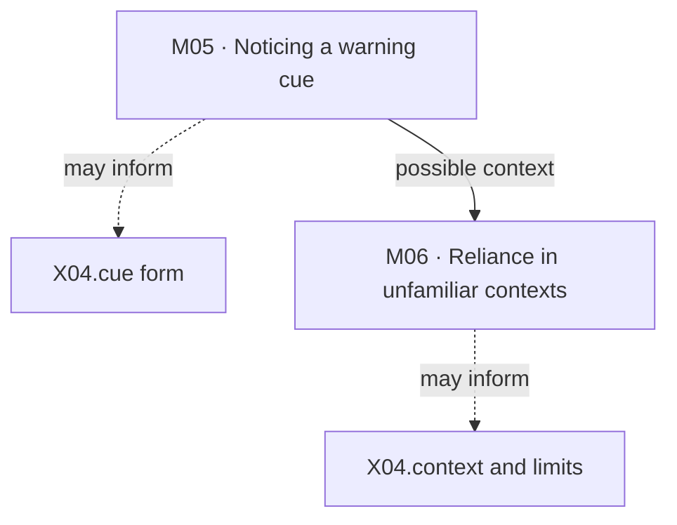

## Adapting to a group


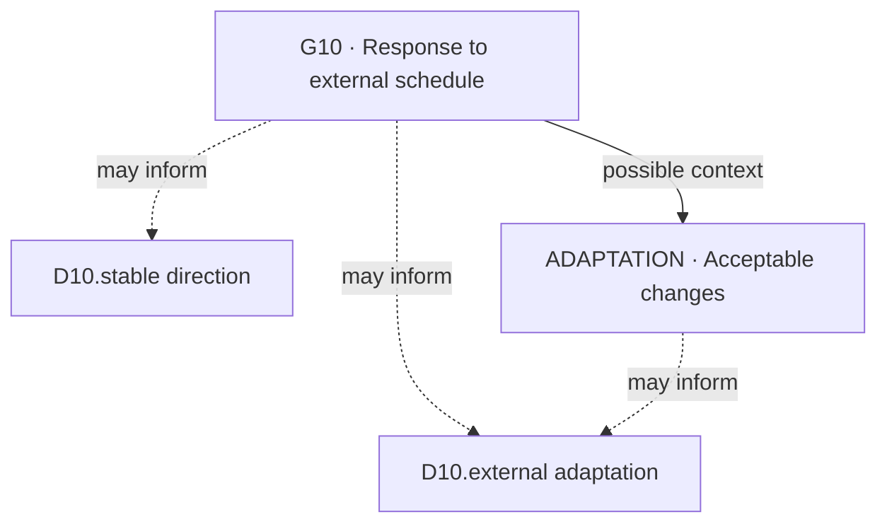

## Money, recognition and ownership


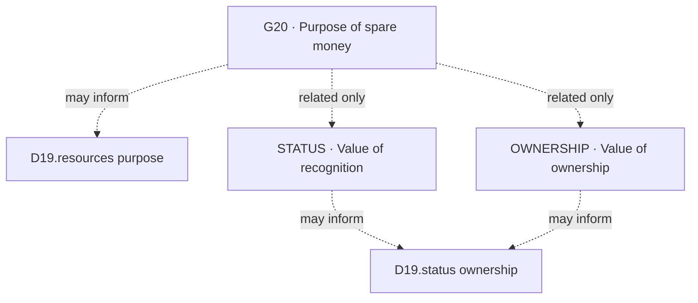

## Following through on a promise


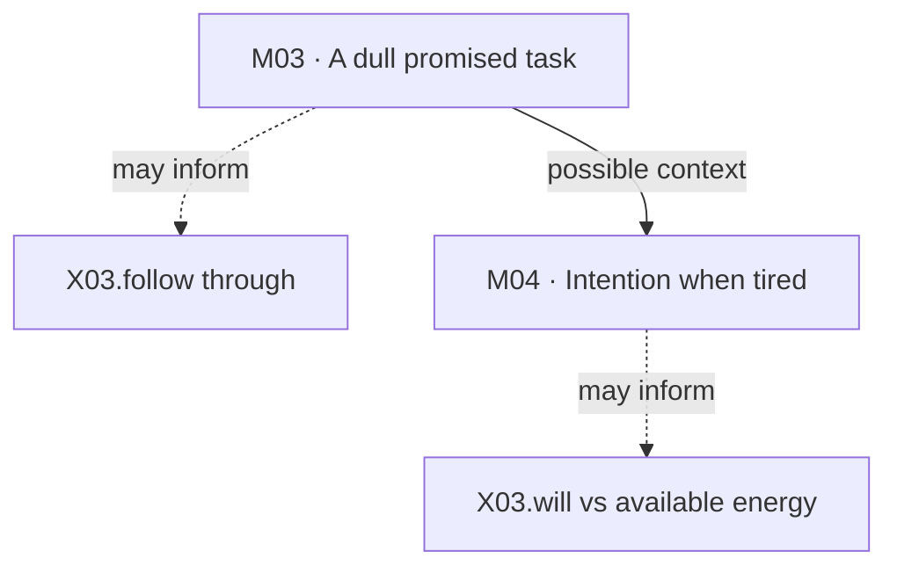

## Routine and change


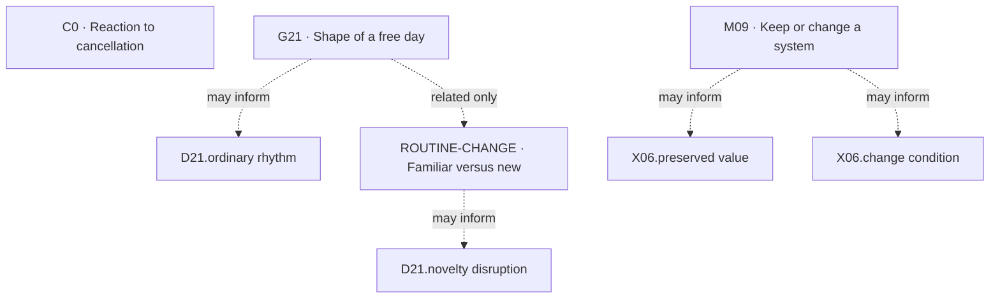

## Room and surroundings


```mermaid
flowchart TD
    f_D11_conditions["D11.conditions"]
    f_D11_functional_effect["D11.functional effect"]
    q_G11["G11 · Room conditions noticed"]
    q_ROOM_EFFECT["ROOM-EFFECT · Effect of the condition"]
    q_G11 -.->|"may inform"| f_D11_conditions
    q_G11 -->|"possible context"| q_ROOM_EFFECT
    q_ROOM_EFFECT -.->|"may inform"| f_D11_functional_effect
```

## Romantic connection


```mermaid
flowchart TD
    f_D12_attraction["D12.attraction"]
    f_D12_deepening["D12.deepening"]
    f_D12_sensuality["D12.sensuality"]
    f_D12_weakening_boundaries["D12.weakening boundaries"]
    q_G12["G12 · What starts attraction"]
    q_G13["G13 · What deepens closeness"]
    q_PHYSICAL_CLOSENESS["PHYSICAL-CLOSENESS · Physical affection"]
    q_R05["R05 · More contact"]
    q_ROMANCE_FADE["ROMANCE-FADE · What weakens closeness"]
    q_G12 -.->|"may inform"| f_D12_attraction
    q_G13 -.->|"may inform"| f_D12_deepening
    q_R05 -.->|"may inform"| f_D12_weakening_boundaries
    q_G13 -->|"possible context"| q_PHYSICAL_CLOSENESS
    q_PHYSICAL_CLOSENESS -.->|"may inform"| f_D12_sensuality
    q_G13 -->|"possible context"| q_ROMANCE_FADE
    q_ROMANCE_FADE -.->|"may inform"| f_D12_weakening_boundaries
```

## Mood alone and with others


```mermaid
flowchart TD
    f_D13_conflict_effect["D13.conflict effect"]
    f_D13_others_effect["D13.others effect"]
    f_D13_recovery["D13.recovery"]
    f_D13_solo_baseline["D13.solo baseline"]
    q_B0["B0 · Response to another’s worry"]
    q_G14["G14 · Mood when alone"]
    q_MOOD_AFTER["MOOD-AFTER · Emotional aftermath"]
    q_R06["R06 · Mood during disagreement"]
    q_G14 -.->|"may inform"| f_D13_solo_baseline
    q_B0 -.->|"may inform"| f_D13_others_effect
    q_R06 -.->|"may inform"| f_D13_conflict_effect
    q_B0 -->|"possible context"| q_MOOD_AFTER
    q_R06 -->|"possible context"| q_MOOD_AFTER
    q_MOOD_AFTER -.->|"may inform"| f_D13_recovery
```

## External pressure to hurry


```mermaid
flowchart TD
    f_X02_after_pressure_removed["X02.after pressure removed"]
    f_X02_under_pressure["X02.under pressure"]
    q_M01["M01 · Internal urgency"]
    q_M02["M02 · After pressure stops"]
    q_M01 -.->|"may inform"| f_X02_under_pressure
    q_M01 -->|"possible context"| q_M02
    q_M02 -.->|"may inform"| f_X02_after_pressure_removed
```

## Workload and energy


```mermaid
flowchart TD
    f_D14_burst["D14.burst"]
    f_D14_ordinary_engagement["D14.ordinary engagement"]
    f_D14_prolonged_overload["D14.prolonged overload"]
    f_D14_stopping_recovery["D14.stopping recovery"]
    q_G15["G15 · Ordinary-work energy"]
    q_R07["R07 · Energy after a burst"]
    q_R08["R08 · Energy after prolonged overload"]
    q_R09["R09 · Stopping cues"]
    q_WORK_RECOVERY["WORK-RECOVERY · Energy after stopping"]
    q_G15 -.->|"may inform"| f_D14_ordinary_engagement
    q_G15 -->|"possible context"| q_R07
    q_R07 -.->|"may inform"| f_D14_burst
    q_G15 -->|"possible context"| q_R08
    q_R08 -.->|"may inform"| f_D14_prolonged_overload
    q_G15 -->|"possible context"| q_R09
    q_R07 -->|"possible context"| q_R09
    q_R08 -->|"possible context"| q_R09
    q_R09 -.->|"may inform"| f_D14_stopping_recovery
    q_G15 -->|"possible context"| q_WORK_RECOVERY
    q_R07 -->|"possible context"| q_WORK_RECOVERY
    q_R08 -->|"possible context"| q_WORK_RECOVERY
    q_WORK_RECOVERY -.->|"may inform"| f_D14_stopping_recovery
```

## Effort worth making


```mermaid
flowchart TD
    f_D15_continue_disengage["D15.continue disengage"]
    f_D15_mobilizer["D15.mobilizer"]
    q_G16["G16 · What makes effort worthwhile"]
    q_R10["R10 · When to disengage"]
    q_G16 -.->|"may inform"| f_D15_mobilizer
    q_G16 -->|"possible context"| q_R10
    q_R10 -.->|"may inform"| f_D15_continue_disengage
```

## Time away and re-entry


```mermaid
flowchart TD
    f_D17_reentry["D17.reentry"]
    f_D17_withdrawal_need_activity["D17.withdrawal need activity"]
    q_G18["G18 · After a social day"]
    q_R11["R11 · Readiness to re-engage"]
    q_G18 -.->|"may inform"| f_D17_withdrawal_need_activity
    q_G18 -->|"possible context"| q_R11
    q_R11 -.->|"may inform"| f_D17_reentry
```

## Earlier and current responses


```mermaid
flowchart TD
    f_D20_continuity["D20.continuity"]
    f_D20_learned_management["D20.learned management"]
    f_D20_phases["D20.phases"]
    q_A0["A0 · Friend asks for company"]
    q_G24["G24 · Earlier-life response"]
    q_LIFE_PHASE["LIFE-PHASE · When change emerged"]
    q_R12["R12 · Attributed contributors"]
    q_A0 -->|"possible context"| q_G24
    q_G24 -.->|"may inform"| f_D20_continuity
    q_G24 -->|"possible context"| q_R12
    q_LIFE_PHASE -->|"possible context"| q_R12
    q_R12 -.->|"may inform"| f_D20_learned_management
    q_G24 -->|"possible context"| q_LIFE_PHASE
    q_LIFE_PHASE -.->|"may inform"| f_D20_phases
```

## Pointing out a mistake


```mermaid
flowchart TD
    f_D16_challenge_threshold["D16.challenge threshold"]
    f_D16_context_cost["D16.context cost"]
    q_CORRECTION_REASON["CORRECTION-REASON · When correction matters"]
    q_G17["G17 · Response to an error"]
    q_G17 -.->|"may inform"| f_D16_challenge_threshold
    q_G17 -->|"possible context"| q_CORRECTION_REASON
    q_CORRECTION_REASON -.->|"may inform"| f_D16_context_cost
    q_CORRECTION_REASON -.->|"may inform"| f_D16_challenge_threshold
```

## Trust and reliability


```mermaid
flowchart TD
    f_X01_repair_access["X01.repair access"]
    f_X01_trust_change["X01.trust change"]
    q_G25["G25 · Trust after missed commitments"]
    q_R13["R13 · Future reliance"]
    q_G25 -.->|"may inform"| f_X01_trust_change
    q_G25 -->|"possible context"| q_R13
    q_R13 -.->|"may inform"| f_X01_repair_access
```
